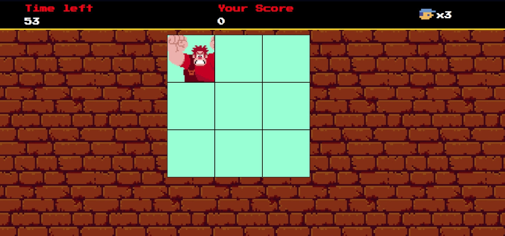

# Detona Ralph 

Jogo baseado no filme "Detona Ralph" feito com Javascript como parte das tarefas do Bootcamp Potência Tech iFood Desenvolvimento de Jogos.

### Deploy
Aplicação em produção [https://daanrox.github.io/detona-ralph/](https://daanrox.github.io/detona-ralph/)

## Tecnologias Utilizadas

O site foi desenvolvido utilizando as seguintes tecnologias:

  
  
  

Não foi utilizado nenhum framework ou biblioteca para o desenvolvimento deste projeto.

## Contato
Se tiver dúvidas ou precisar de mais informações, sinta-se à vontade para entrar em contato:
- Email : [contato@daanrox.com](mailto:contato@daanrox.com)
- LinkedIn: [https://www.linkedin.com/in/daanrox/](Daanrox)

--- 

Projeto desenvolvido durante o Bootcamp Potência Tech iFood
